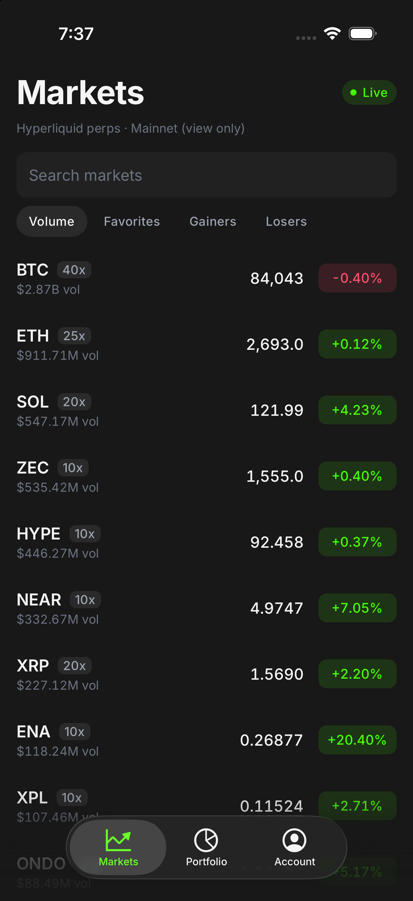
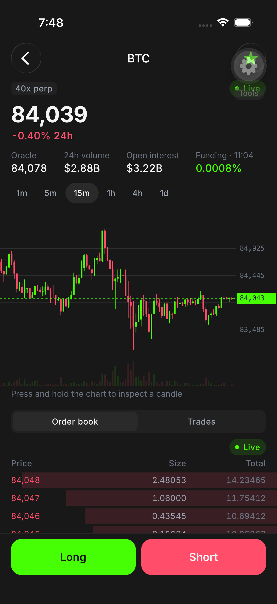
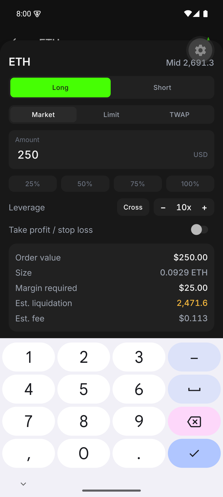
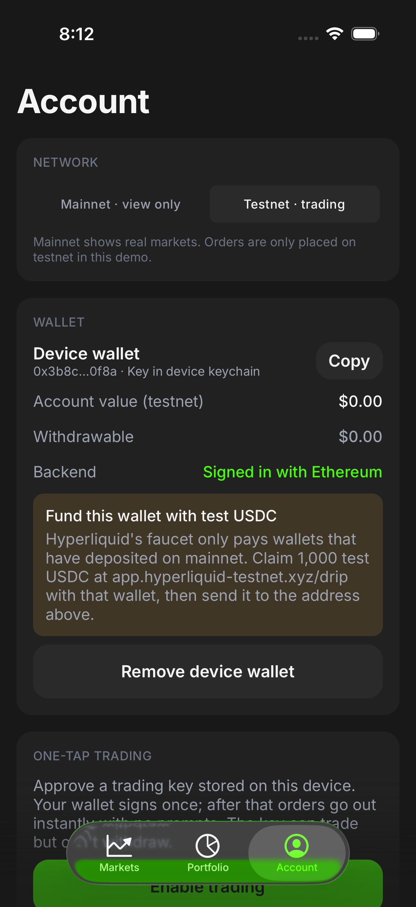

# Tape

Tape is a mobile perps trading app on Hyperliquid, built with Expo SDK 57, React Native 0.86 and TypeScript. It shows live mainnet markets and places real orders on Hyperliquid testnet. Built by Jesse Krim.

| Markets | Trade | Order ticket (Android) | Wallet |
|---|---|---|---|
|  |  |  |  |

## What it does

- **Live markets.** All Hyperliquid perps over one shared WebSocket. Updates are applied once per frame, rows re-render only when their own market changes, and every screen says whether its data is live, delayed or reconnecting.
- **Trade screen.** Skia candle chart with a crosshair that runs on the UI thread, fast order book (2 updates a second), trade tape, funding countdown.
- **Wallet.** Privy embedded wallets (EVM and Solana) via email, or a key generated on the device. The wallet approves a trading key once, then every order is signed on the phone with no prompt. The trading key can't withdraw.
- **Orders.** Market, limit and TWAP, leverage, cross or isolated margin, take profit and stop loss. Positions and PnL come straight from the exchange.
- **Backend.** Supabase with Sign in with Ethereum. The watchlist is protected by row-level security and tested with pgTAP.
- **Deposits.** Live Relay quotes for moving USDC from Base, Arbitrum or Ethereum into Hyperliquid. Quote only; no mainnet transactions are sent.
- **Releases.** EAS Workflows: checks on every PR and a weekly release that ships an over-the-air update or a new store build depending on the native fingerprint.

## Run it

```bash
npm install
cp .env.example .env.local   # add Privy and Supabase values, or leave Privy empty to use a device wallet
npx expo run:ios             # or: npx expo run:android
```

Placing filled orders needs test USDC in the wallet. Hyperliquid's testnet faucet only pays addresses that have deposited on mainnet, so without it the exchange answers "Must deposit before performing actions", which the app shows as returned.

## Checks

```bash
npm run typecheck
npm test                                   # trading math and formatting (node --test)
npx supabase@latest test db                # row-level security (pgTAP), needs `npx supabase@latest start`
maestro test -e DEV_CLIENT=true .maestro   # end-to-end flows on a simulator or emulator
```

## Docs

- [Architecture](docs/ARCHITECTURE.md): how data, wallets, orders and releases fit together.
- [Stack decisions](docs/STACK.md): each choice, what else was considered, and where I've shipped it before.
- [Real-time data and performance](docs/PERFORMANCE.md): keeping the screen honest, holding the frame rate, and what has been measured.
- [Shipping](docs/SHIPPING.md): the weekly release pipeline and how I work.
