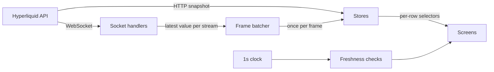
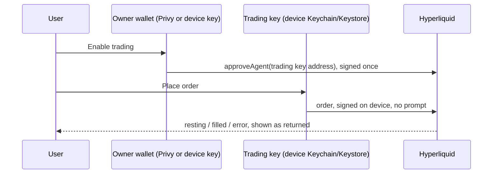

# Tape architecture

Tape is a mobile perps trading app on Hyperliquid, built with Expo SDK 57, React Native 0.86 and TypeScript. It shows live mainnet markets read-only and places real orders on Hyperliquid testnet. This document describes how the app works. It is kept current with the code.

## Folder layout

| Path | What lives there |
|---|---|
| `src/app/` | Routes (Expo Router). Tabs: Markets, Portfolio, Account. Stack screens: `market/[coin]`, `order` (native form sheet). |
| `src/market/` | The live-data layer: socket clients, frame batcher, stores, freshness rules, diagnostics counters. |
| `src/trading/` | Pure trading math and formatting (tested with `node --test`), plus order submission. |
| `src/wallet/` | Owner wallet (Privy or device key), trading key approval, account feed. |
| `src/backend/` | Supabase client and Sign in with Ethereum. |
| `src/deposit/` | Cross-chain deposit quotes from Relay (read only). |
| `src/lib/` | Monitoring (Sentry) and analytics (PostHog). |
| `supabase/` | Migrations, pgTAP tests and auth config for the backend. |
| `src/ui/` | Design tokens (`theme.ts`) and components. Every color and size comes from `theme.ts`. |
| `.maestro/` | End-to-end flows, also run by the weekly release workflow. |
| `.eas/workflows/` | PR checks and the weekly release pipeline. |

## Market data

**One socket per network.** `src/market/clients.ts` creates one `WebSocketTransport` per network and every screen shares it. Opening a market adds subscriptions to that socket; closing the screen removes them. The SDK reconnects with exponential backoff and resubscribes by itself. We listen to the socket's `open` and `close` events so the UI can say when data is not live.

**Snapshot first, then stream.** The markets list loads `metaAndAssetCtxs` over HTTP so it paints immediately, then subscribes to `assetCtxs` for live updates. Candles load history over HTTP and then stream the forming candle.

**Frame batching.** Socket handlers never set React state. They register "apply the latest value" jobs in `src/market/batcher.ts`, keyed by stream, and the batcher runs pending jobs once per animation frame. A newer message for the same stream replaces the older job. React renders at most once per frame however many messages arrive, which matters during bursts. Trades are the exception: they are events rather than snapshots, so they are buffered and appended together instead of replaced.

**Narrow re-renders.** When the 178-market update arrives, each market keeps its previous object if its numbers did not change (`applyCtxs` in `src/market/markets.ts`). List rows select only their own market, so a BTC price change re-renders the BTC row and nothing else. The price flash on each row runs on the UI thread with Reanimated.

**Ordering.** Order book messages carry the exchange timestamp. A snapshot older than the one on screen is dropped. Hyperliquid sends full book snapshots, not deltas, so there is no local book to reconcile.

**Measured cadence** (mainnet, 20 second samples, 2026-09-25):

| Stream | Rate | Used for |
|---|---|---|
| `assetCtxs` (all perps) | every ~4s, ~55 KB | Markets list |
| `l2Book` default | 20 levels every ~4s | Not used |
| `l2Book` with `fast: true` | 5 levels, 2 per second, worst gap 646 ms | Order book |
| `activeAssetCtx` | about 1 per second | Trade screen header, funding |
| `bbo` | about 3 per second | Not used yet |
| `trades` (BTC, ETH) | 2 to 3 trades per second | Trade tape |

The trade screen uses the fast book because freshness matters more than depth on a phone, and five levels per side is what fits above the fold.

## Freshness

`src/market/freshness.ts` sets how long each stream may go quiet before the UI stops calling it live: 12 s for the markets list, 3 s for the book, 5 s for the focused asset. These are about three missed updates at the measured cadence. A single one-second clock drives every freshness check, and components select a boolean from it, so they re-render only when "live" flips.

`LiveBadge` shows Live, Delayed Ns, Reconnecting, or Connecting. The order ticket refuses to submit while the book is stale. When the app returns from more than 5 s in the background, the socket reconnects to force fresh snapshots, because iOS can leave a dead socket without a close event.

## Wallet and trading

**Owner wallet.** Either a Privy embedded wallet (email login) or a private key generated on the device. Both become the same `Owner` shape in `src/wallet/store.ts`, so trading code does not know which one it has. Privy's embedded wallet is an EIP-1193 provider, wrapped with viem's `createWalletClient`, which the Hyperliquid SDK accepts directly. Privy turns on when `EXPO_PUBLIC_PRIVY_APP_ID` is set; without it the app runs end to end on the device key.

**Trading key.** Hyperliquid lets an account approve an "agent" key that can place and cancel orders but cannot withdraw. Tape generates that key on the device and stores it with `expo-secure-store` using `WHEN_UNLOCKED_THIS_DEVICE_ONLY`, so it is readable only while the phone is unlocked and never leaves the device in a backup. The owner signs one approval; after that every order is signed locally with no prompt. Whether the key is approved is read from the exchange (`extraAgents`), not from local state.

**Signing domains.** Account-level actions are EIP-712 signed with the Arbitrum chain id (`0xa4b1` mainnet, `0x66eee` testnet), matching Hyperliquid's own app. Asset ids differ by network (BTC is 0 on mainnet and 3 on testnet), so they always come from the current network's `meta`.

**Orders.** `src/trading/orders.ts` sets leverage, then sends the order.
- Market orders are IOC limit orders capped at mid ± 5%, the same default as the official SDKs.
- TP/SL are reduce-only trigger orders grouped with the entry (`normalTpsl`).
- TWAP uses Hyperliquid's native `twapOrder` (5 to 1440 minutes).

Prices and sizes are rounded by `toWirePrice` and `toWireSize`, which follow the documented tick and lot rules and are unit tested against the examples in Hyperliquid's docs.

**What the UI trusts.** Before an order, the ticket shows estimates: margin, fee at the base tier, and liquidation price from the documented formula. After an order, the app shows only what the exchange returned: the order outcome, and positions from the `clearinghouseState` stream including the exchange's own `liquidationPx` and PnL. Exchange errors are shown verbatim.

## Backend

Supabase holds user data only: today, the watchlist. Market data never passes through it.

- **Sign in with Ethereum.** When a wallet connects, the app builds an EIP-4361 message with viem (`createSiweMessage`), the owner wallet signs it, and `supabase.auth.signInWithWeb3` verifies it and returns a session. The message's domain (`tape.local`) must match an allowed redirect URL in `supabase/config.toml`. No session is stored on the device; the wallet signs again at launch, which is silent for both wallet types.
- **Row-level security.** `watchlist` rows belong to `auth.uid()`. Users can read, add and remove only their own rows. `supabase/tests/watchlist_rls.test.sql` checks that another wallet can't read them or write as their owner, and that anonymous callers see nothing.
- **Watchlist sync.** Favorites change locally first, then write to Supabase; a failed write rolls the change back. Optimistic updates are acceptable for a watchlist and are never used for orders.

## Deposit quotes

`src/deposit/relay.ts` asks Relay for a route from USDC on Base, Arbitrum or Ethereum into the user's Hyperliquid perps balance (Relay chain 1337). The sheet shows what arrives, the relayer and gas fees, the time estimate and the wallet steps, and refreshes the quote every 15 s with its age shown. Relay's response also contains ready-to-sign mainnet transactions; Tape never sends them.

## Monitoring, analytics and updates

- Sentry wraps the root layout, and every feed error is reported with its stream name. Off unless `EXPO_PUBLIC_SENTRY_DSN` is set.
- PostHog events come from a typed list in `src/lib/analytics.ts`. No event carries a wallet address, key, balance or order size. Off unless `EXPO_PUBLIC_POSTHOG_KEY` is set.
- `expo-updates` with `runtimeVersion: { policy: "fingerprint" }`, so an over-the-air update only reaches builds with a matching native layer.

## Testing

- `npm test` runs `node --test` over `src/**/*.test.ts`: tick and lot rounding, liquidation estimates, ticket validation, formatting, and the Relay quote parser against a recorded response.
- `npx supabase@latest test db` runs the pgTAP row-level security tests.
- `npm run typecheck` runs `tsc` in strict mode.
- Maestro flows in `.maestro/`: markets to trade screen, order ticket blocking rules, wallet creation and trading approval against testnet, deposit quote.

## Build and release

- `eas.json` profiles: `development`, `development-simulator`, `e2e` (simulator build and Android APK for Maestro), `preview`, `production`.
- `.eas/workflows/pr-checks.yml`: typecheck, unit tests and native fingerprint on every PR.
- `.eas/workflows/weekly-release.yml`: every Tuesday 14:00 GMT. Gates on tests and Maestro, then fingerprints the native layer. If a store build with the same fingerprint exists it ships an over-the-air update; otherwise it builds and submits to TestFlight and the Play internal track.

## Known issue: React Compiler and imported counters

React Compiler 1.0 compiled `counters.book++` inside a hook, where `counters` is an imported object, into `counters.book = module.book + 1`, which is NaN. The diagnostics panel showed NaN, and the compiled bundle confirmed it. Every counter now goes through `countMessage()` in `src/market/diagnostics.ts`, a plain function the compiler does not transform. Avoid mutating imported objects inside components and hooks.

## Dependency notes

- `viem` is pinned to 2.56.0 because `@privy-io/expo` pins that exact version.
- `.npmrc` sets `legacy-peer-deps=true`. Privy lists `permissionless` as an optional peer that wants an older `ox` than viem ships. Tape does not use Privy smart wallets, so the mismatch is accepted everywhere, including EAS builds.
- `metro.config.js` resolves `isows` without package exports and `jose` with the browser condition, per Privy's setup guide.
- `entrypoint.js` loads `fast-text-encoding`, `react-native-get-random-values` and `@ethersproject/shims` before the router.
