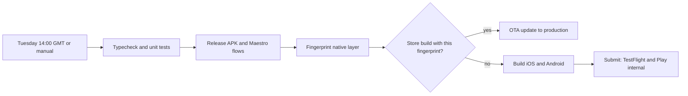

# How Tape ships

## Weekly release

`.eas/workflows/weekly-release.yml` runs every Tuesday at 14:00 GMT, and can be started from the EAS dashboard.

1. **Gate on tests.** Typecheck and the unit tests must pass.
2. **Gate on end-to-end flows.** A release-config Android APK is built and the Maestro flows run against it: markets to trade screen, order ticket rules, wallet creation and trading approval.
3. **Fingerprint.** `runtimeVersion` uses Expo's fingerprint policy, a hash of everything native.
4. **Choose the path per platform.** If a store build with the same fingerprint exists, the week's changes are JavaScript only and ship as an over-the-air update in minutes, with no store review. If not, the workflow builds a new binary and submits it: TestFlight on iOS, the internal track as a draft on Android.

Every pull request runs `.eas/workflows/pr-checks.yml`: typecheck, unit tests, and the fingerprint, which shows whether merging will need a new binary.

To roll back an over-the-air update, republish the previous update group to the `production` branch. Binaries that ran the bad update pick up the previous one on next launch.

### Before the first scheduled run

The workflows are written and the EAS project exists (`@jakrim/tape`), but they have not run yet. They need:

- The GitHub repository connected to the EAS project, so scheduled and PR runs trigger.
- App Store Connect and Google Play credentials in EAS for submission, and store records for the app.
- A Sentry auth token if source maps should upload (disabled until then via `SENTRY_DISABLE_AUTO_UPLOAD`).

## How I work

These habits come from shipping Get Mentors, LiveVault and Our Little World, and they shaped this build.

- **Name every state before building a screen.** Loading, empty, offline, stale, error, and the account state (no wallet, unfunded, trading not enabled). In Tape the markets list has loading, error with retry, empty search and stale states, and the order ticket's button always says why it can't submit.
- **Small phases with a "done when".** This build went in four: live market data, wallet and trading, backend, release pipeline. Each ended in a commit that ran on a simulator.
- **Check the real thing, not just the tests.** After unit tests, the actual flow runs on the iOS simulator and an Android emulator, and I read the screenshots. That caught a liquidation estimate above entry for a long position (now a regression test), and the diagnostics panel caught a React Compiler miscompile that unit tests could not see.
- **Release with evidence.** In Our Little World a release record lists the test counts (439 of 439 app tests, 94 of 94 database checks) and the fingerprint match on a clean commit. In Get Mentors a release candidate stays marked not ready until it has been checked on a physical device.
- **Keep numbers honest.** Estimates are labeled as estimates, exchange errors are shown as returned, and these docs separate what was measured from what was not.
